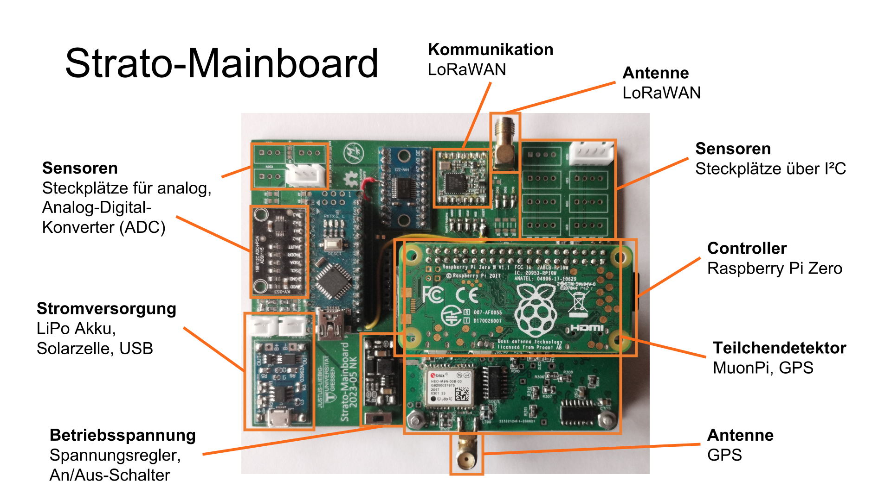

# Strato-Mainboard Hardware Anleitung

## Material

- Lötkolben, Lötzinn, Pinzette, Platinenhalter, Seitenschneider,  ...
- Alle Komponenten der Liste Strato_Mainboard_Bauteile
- Isolierter Draht 0,1-0,8mm²
- Silberdraht / männliche Pinheader
- Isolierband

## Vorbereitung

- Platine reinigen (zB mit Ethanol )
- Platine so herum legen, dass die Schrift “Strato-Mainboard” richtig herum zu lesen ist (Worte wie links, rechts, oben, unten beziehen sich __immer__ auf diese Orientierung)

## Montage

### SMD-Bauteile anlöten

Widerstände:

| R3  | R4  | R5  | R6  | R11  | R12  |
|-----|-----|-----|-----|------|------|
| 20k | 51k | 51k | 51k | 4,7k | 4,7k |

Dioden:

Orientierung beachten, Kathode (schwarze Markierung) muss in Richtung der Markierung auf der Platine zeigen

| D2     | D3     | D4     |
|--------|--------|--------|
| LL4148 | LL4148 | LL4148 |

1. Jeweils ein Lötpad der SMD-Pads mit Lötzinn bedecken
2. SMD-Bauteile mit der Pinzette nehmen und an dieser Seite fest löten
3. Andere Lötpäds mit der anderen Seite der Bauteile verlöten

### Lötbrücken-Jumper anlöten

1. Links neben und unter dem Bereich von U4 (LoRa-Modul) befinden sich 8 Lötbrücken-Jumper “RasPI | Arduino”. Bei allen 8 Jumpern linkes und mittleres Pad mit Lötzinn verbinden, um das LoRa-Modul an den RasPi anzuschließen
2. Links neben dem Bereich von U3 (ADC) befinden sich 2 Jumper “AKKU | ADC0” und “SOLAR | ADC1”. Bei beiden linkes und mittleres Pad mit Lötzinn verbinden, um Akku- und Solar-Spannung messen zu können
3. Dort befindet sich auch ein Jumper “ADDR”. Dessen beide Pads mit Lötzinn verbinden, damit die I²C Adresse des ADC auf 0x4a geändert wird

### Pins an Breakoutboards anlöten

1. Spannungsregler SDB628, Laderegler 03962A, ADC ADS1115 bereit legen
2. 18x männliche Pinheader oder Silberdraht bereitlegen, dabei etwa 10mm lange Stücke schneiden
3. Pinheader oder Drahtstücke von der Rückseite in die Löcher der Breakoutboards führen, sodass auf der Vorderseite noch ca 2mm heraus schauen (Bei Laderegler 03962A nicht die Pins B+ und B- verwenden)
4. Möglichst gerade fest löten
5. Rückseite der Breakoutboards mit Isolierband bekleben, damit kein metallischer Kontakt zur Platine entstehen kann
6. Falls Pinheader verwendet wurden, können dessen Plastikverbinder abgezogen werden, damit die Breakoutboards direkt aufliegen (Geschmackssache)

### Breakoutboards und LoRa-Modul anlöten

| U1                | U2                     | U3          | U4               |
|-------------------|------------------------|-------------|------------------|
| Laderegler 03962A | Spannungsregler SDB628 | ADC ADS1115 | LoRa Modul RFM95 |

1. Vorbereitete Breakoutboards mit Pins an ihre Position stecken
2. Von Rückseite fest löten
3. Überstehende Pins abschneiden
4. Ein Lötpad von U4 mit Lötzinn bedecken
5. LoRa-Modul RFM95 auf angegebenen Platz legen, dessen größter schwarzer Chip muss nach oben links zeigen
6. Das vorbereitete Lötpad an das LoRa-Modul anlöten und genau ausrichten
7. Zuerst die Lötpads an den Ecken, dann alle restlichen anlöten

### Stecker und Schalter anlöten

1. Den An-Aus-Schalter an S1 von vorne durch die Platine Stecken und von hinten fest löten
2. An die Stellen “AKKU” und “SOLAR” kommt jeweils eine JST-Buchse mit 2 Pins. Diese müssen so herum sitzen, dass sie den Rahmen nicht überschreiten. Ebenfalls von der Rückseite festlöten
3. Gleiches Vorgehen für alle JST-Buchsen bei “ADC” und “I2C”. Es müssen nur so viele Buchsen bestückt werden wie benötigt
4. Den 2x20 Pinheader für den Raspberry Pi von vorne an A1 stecken und von der Rückseite verlöten. Erst die Ecken, dann den Rest
5. Der SMA-Stecker für die LoRa-Antenne wird an “ANT LORA” gelötet. Es kann sinnvoll sein, ihn auf die Rückseite zu löten, da die Platine meistens flach in der Payload-Box liegt und die Antenne nach unten heraus geführt wird

### Fehlenden LoRa Reset Pin verbinden

Fehler beim Erstellen der Platine wurde gemacht: Reset-Pin des LoRa-Chips ist nicht verbunden → muss manuell gezogen werden

1. Ca 10cm isolierten Draht abschneiden und Enden abisolieren
2. Auf der Rückseite des Strato-Mainboards Pin 40 des Raspberry Pi Headers an das Kabel löten (Pin 1 ist einziger Pin mit eckigem Lötpad, Pin 40 ist am weitesten davon entfernt)
3. Kabel durch das Loch unten links von U5 (Orientierung Vorderseite) auf die Vorderseite führen
4. Ende des Kabels am Lötbrücken-Jumper “RESET” fest löten

### Kabel vorbereiten

Vorsicht! Akku steht immer unter Spannung, keinen Kurzschluss durch metallische Objekte wie zB Lötkolben oder Seitenschneider verursachen!

1. Beide Kabel des Akkus so nah es geht am Stecker nacheinander durchschneiden
2. Beide Enden etwa 2mm weit abisolieren
3. Aus dem JST-Stecker-Set jeweils eine Hülse auf die Kabel crimpen
4. Die Hülsen so herum in einen zweipoligen JST-Stecker stecken, dass das rote Kabel mit der Bezeichnung “+” auf dem Strato-Mainboard verbunden wäre (Stecker noch nicht einstecken)
5. Die vierpoligen Stecker für I²C-Sensoren haben schon Kabel angeschlossen. Es empfiehlt sich die Farbreihenfolge so zu ändern, dass rot immer mit VCC und schwarz mit GND verbunden ist, da dies Standard ist. Auf dem Strato-Mainboard ist gekennzeichnet wie die Reihenfolge orientiert ist: VCC - GND - SCL - SDA. Die Hülsen lassen sich aus dem Stecker entfernen in dem der metallische Widerhaken von außen herunter gedrückt und die Hülse am Kabel heraus gezogen wird.
6. Diese Kabel mit Hülsen lassen sich ebenfalls in die dreipoligen Stecker für analoge Sensoren stecken.  Wahlweise können die Stecker auch selbst gecrimpt werden, je nach Anwendungsfall

## Prüfen

1. Die Verbindung aller Pins, die verbunden, wurden mit einem Multimeter nachprüfen
2. Ebenfalls prüfen, dass benachbarte Pins nicht verbunden sind
3. Erst nach dem Prüfen darf die Platine in Betrieb genommen werden, sonst kann es zu Zerstörung von Bauteilen führen

### Die fertige Platine sollte so aussehen

